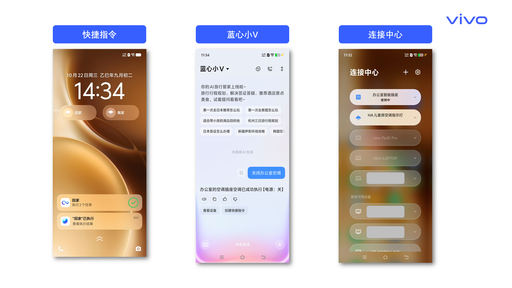
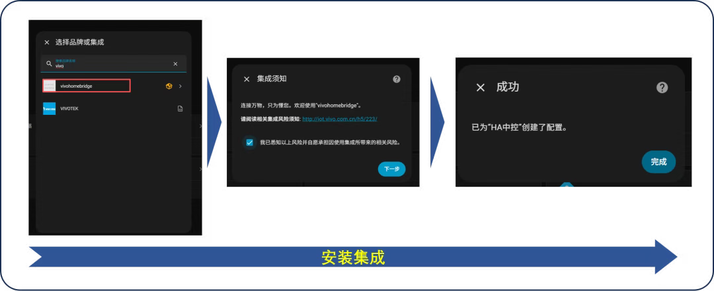
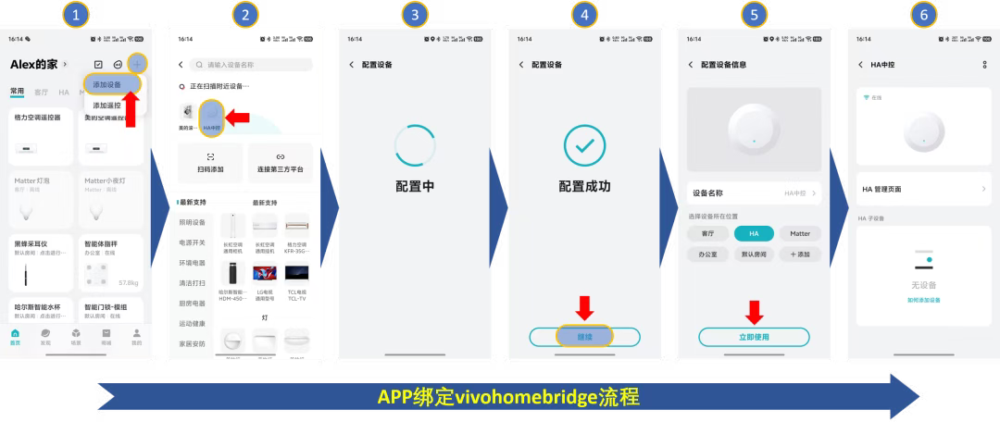
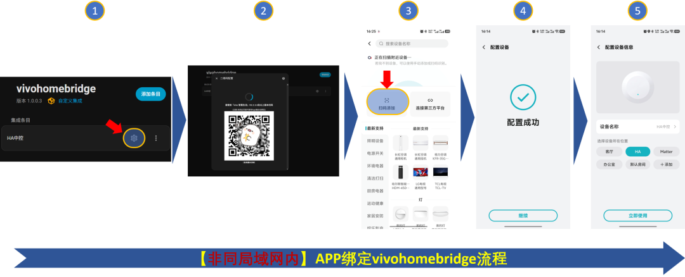
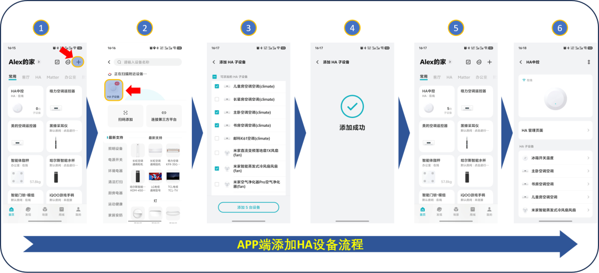
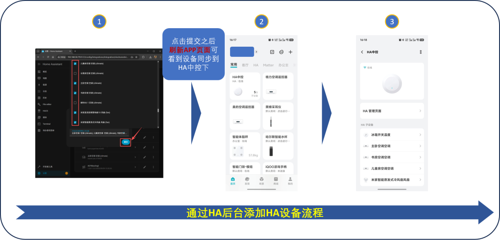
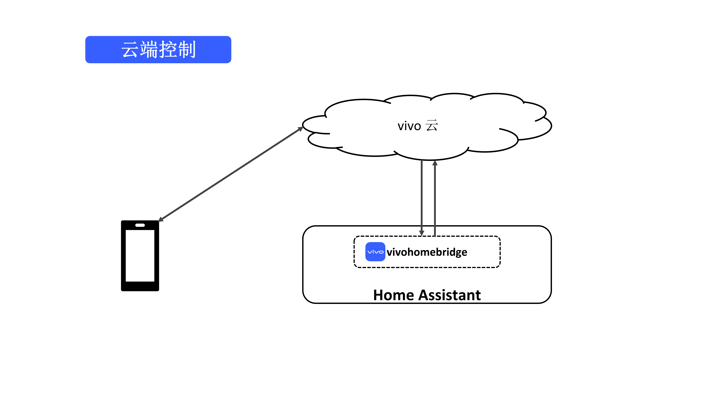

# vivohomebridge

## 简介
[简体中文](./README.md) | [English](./README_EN.md) 

**vivohomebridge**作为 **[Home Assistant](https://www.home-assistant.io/)** 上的一个集成，具有以下功能:

- 把接入HA平台的设备(实体)映射到vivo IoT生态中； 
- 接入vivo IoT生态后可以使用vivo手机系统能力进行设备管理，如**vivo智慧生活**、**连接中心**、**蓝心小V语音助手**、**快捷指令等**手机系统能力无缝体验vivo IoT生态能力；

## 集成优势
- **打破生态壁垒：**  将您 HA 平台中连接的各类设备（无论品牌）无缝同步到 vivo 智慧生活 App 中。
- **统一控制体验：** 直接在 vivo 智慧生活主界面集中控制所有已接入 HA 的设备，实现真正的一站式智能家居管理。
- **远程控制：** vivo提供了设备云服务，使设备接入vivo生态之后可以直接获得设备远程控制能力；
- **系统级集成(vivo手机)：** vivo在系统层面深度集成了HA，这意味着用户可以直接在系统设置中访问和管理HA设备,如语音控制、连接中心、快捷指令等。
- **便捷智能联动(vivo手机)：** 利用 vivo 智慧生活平台的能力，轻松搭建跨品牌、跨生态的自动化场景和智能联动。

## vivo手机特有设备控制功能展示
- `OriginOS` ≥ **6.0**
  


## 品类支持范围
我们会持续迭代支持更多品类，目前支持以下品类：
1. ❄️空调
2. 🌀风扇
3. 💡灯
4. 🔌插座
5. 🔛开关
6. 🪟窗帘电机
7. 🚶占位传感器(如:人体移动传感器)
8. 🌡️💧温湿度传感器
9. 🚪开合传感器(如:门磁传感器)
10. ☀️光照传感器
11. ⚙️通用传感器
12. 📺电视遥控器
13. 💦热水器

## 环境要求
- Home Assistant Core ≥ 2025.1
- vivo智慧生活APP ≥ 6.0.0.0
- 运行平台: Linux系统下的aarch64或x86_64平台；
## 集成下载和安装

### 下载方式
#### 方式1: HACS(推荐)
- 目前可通过手动添加`Github`地址到`HACS`,然后通过`HACS`来下载。
- 后续会提交到`HACS`官方`default`，则可以直接搜索下载；
- 搜索名称：`vivohomebridge`
#### 方式2: Git
通过终端 `git` 命令行方式下载集成
命令行进入到HA的`config/custom_components`目录下，然后执行如下命令
```sh
cd config/custom_components 
git clone https://github.com/vivo/ha_vivohomebridge.git
```
然后将文件夹vivohomebridge(在ha_vivohomebridge/custom_components目录中)复制到HA的 `config/custom_components` ⽬录下。
**重启HA**
#### 方式3: Samba/FTPS(文件传输)
1. 从 https://github.com/vivo/ha_vivohomebridge 下载最新的版本的zip文件。
2. 把下载的zip文件解压,然后将文件夹vivohomebridge(在ha_vivohomebridge/custom_components目录中)复制到HA的 `config/custom_components` ⽬录下。
3. **重启HA。**
### 安装
在`HommeAssistant`后台:⚙️ 设置 > 设备与服务 > 添加集成 > 🔍搜索vivo或者vivohomebridge将出现的集成点击安装，然后根据提示一直点击下一步,最后点击完成即可,如下图；

## 集成使用
集成使用第一步需要先通过vivo智慧生活进行绑定之后方可正常使用。 这里分两种情况，两种绑定方式略有不同:
1. 第一种是你的HomeAssistant和你的手机在同一个局域网内；
2. 第二种是你的HomeAssistant和手机不在同一个局域网内(比如你的HA环境是在Docker容器中)或非vivo手机。

### 情况1: HomeAssistant和手机在同一个局域网内
**注意：** 此方法只支持vivo手机
示意图如下

### 情况2：HomeAssistant和手机不在同一个局域网内或非vivo手机
**注意：** vivo和非vivo手机都支持
示意图如下:


## 添加设备

### 前提条件
你的`Home Assistant`已经添加了HA设备,并且是[支持的品类范围](#品类支持范围);
### 方式1：APP端添加(推荐)

### 方式2：HA后台添加


## 设备控制链路
