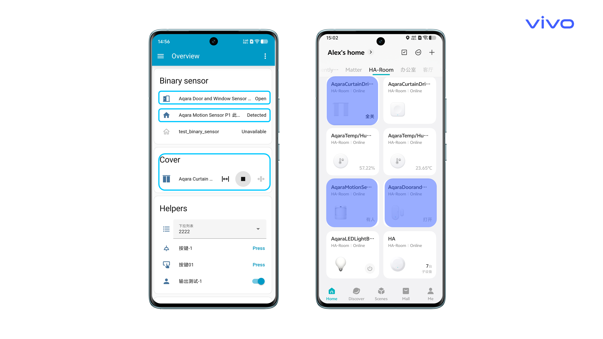
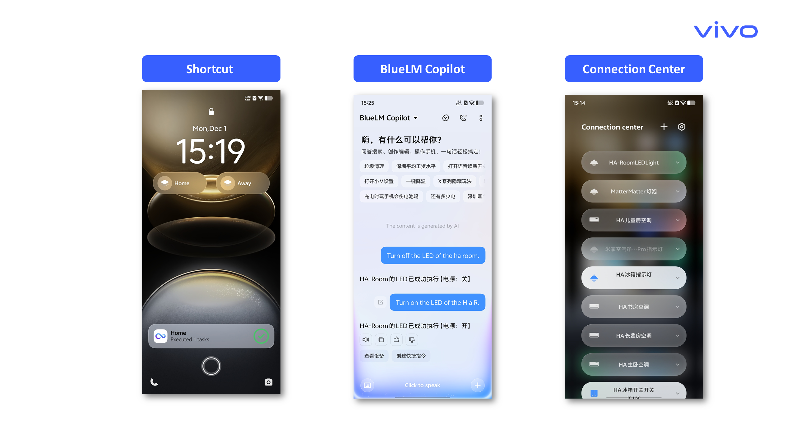
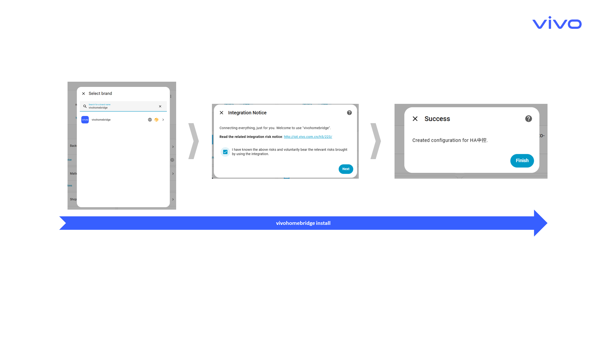
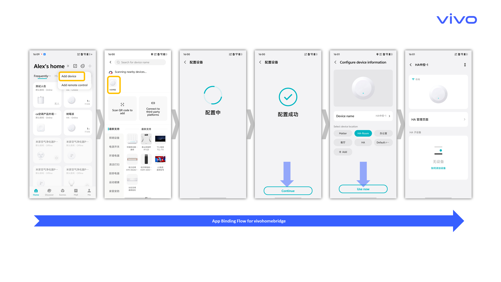
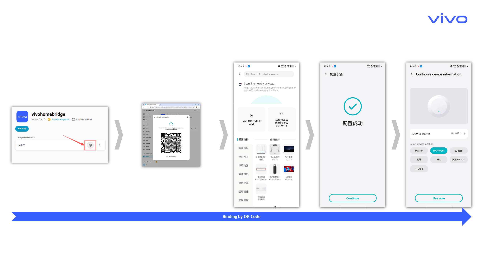
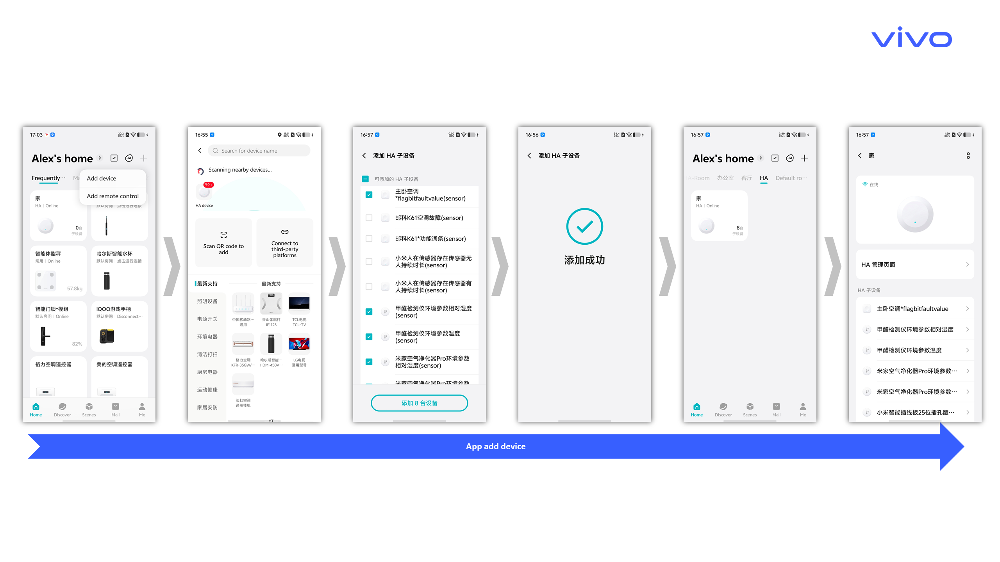
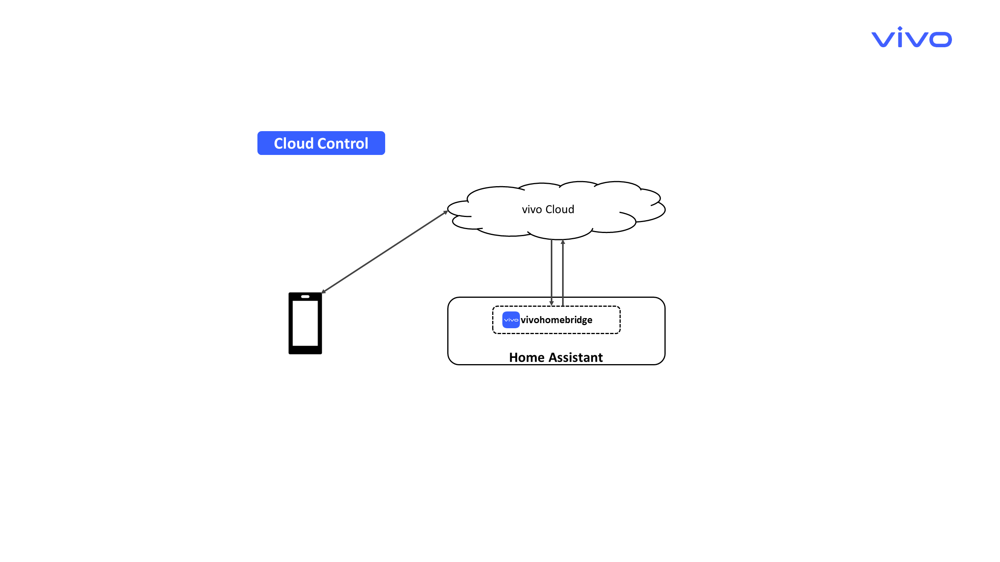

# vivohomebridge
## Introduction
[简体中文](./README.md) | [English](./README_EN.md) 

**vivohomebridge** is an integration running on **[Home Assistant](https://www.home-assistant.io/)**, with the following main functions:
 - It maps devices (entities) connected to the HA platform into the vivo IoT ecosystem.
 - Enables seamless integration with vivo’s IoT ecosystem, allowing users to manage these devices through vivo’s system capabilities — such as **JoviInLife App**, **Connection Center**, **BlueLM Copilot**, and **Shortcut Commands** — for a unified and smooth vivo IoT experience.

## Integration Advantages
- **Break the ecosystem barrier:** Seamlessly synchronize devices from the HA platform (regardless of brand) to the vivo JoviInLife app.

- **Unified control experience:** Manage all HA-connected devices directly within the main interface of vivo JoviInLife app, achieving a truly unified smart home experience.

- **Remote control:** vivo provides cloud-based device control, allowing you to remotely control your devices once connected to the vivo ecosystem.

- **System-level integration (for vivo phones):** vivo deeply integrates with Home Assistant at the system level, meaning you can access and control HA devices directly from system settings — such as voice control, Connection Center, and Shortcut Commands.

- **Convenient intelligent automation (for vivo phones):** Leverage  vivo JoviInLife automation capabilities to easily build cross-brand, cross-ecosystem smart scenarios and automations.
  
## vivo phone unique device control function display


## Supported Device Categories
We continuously expand supported categories. Currently, the following are supported:

1. ❄️ Air Conditioner
2. 🌀 Fan
3. 💡 Light
4. 🔌 Plug
5. 🔛 Switch
6. 🪟 Curtain Motor
7. 🚶 Occupancy Sensor (e.g., motion detector)
8. 🌡️💧 Temperature & Humidity Sensor
9. 🚪 Contact Sensor (e.g., door/window sensor)
10. ☀️ Illuminance Sensor
11. ⚙️ General Sensor
12. 📺 TV Remote Controller
13. 💦 Water Heater

## Requirements

- Home Assistant Core ≥ 2025.1
- vivo JoviInLife app ≥ 6.0.0.0
- Runtime Platform: Linux systems on aarch64 or x86_64 architectures.

## Integration Download and Installation

### Download Methods

#### Method 1: HACS (Recommended)
- You can manually add the GitHub repository URL to HACS, and then download it via HACS.
- It will later be submitted to the HACS official default repository, allowing direct search and installation.
- search：`vivohomebridge`
#### Method 2: Git
Download the integration using the `git` command in your terminal:
Navigate to the HA `config/custom_components` directory, then run:
```sh
cd config/custom_components
git clone https://github.com/vivo/ha_vivohomebridge.git
```
Then copy the `vivohomebridge` folder (located in `ha_vivohomebridge/custom_components`) to the `config/custom_components` directory in Home Assistant.
**And Restart Home Assistant**.
#### Method 3: Samba / FTPS (File Transfer)
1. Download the latest version ZIP from https://github.com/vivo/ha_vivohomebridge
2. Unzip the file, Then copy the `vivohomebridge` folder (located in `ha_vivohomebridge/custom_components`) to the `config/custom_components` directory in Home Assistant.
3. **Restart Home Assistant**.

### Installation
In the `Home Assistant` UI:
⚙️ Settings > Devices & Services > Add Integration > 🔍 Search for "vivo" or "vivohomebridge", then follow the prompts to complete installation by clicking Next until Finish, as shown below:



## Integration Usage
Before use, you must first bind the integration via the **vivo JoviInLife app**.
There are two scenarios with slightly different binding methods:
1. When your Home Assistant and smartphone are on the same local network.
2. When your Home Assistant and smartphone are not on the same network (eg: HA runs in Docker) or you are using a non-vivo phone.

### Case 1: Home Assistant and Phone on the Same Local Network

**Note:** This method only supports vivo phones.
Illustration:


### Case 2: Home Assistant and Phone Not on the Same Network or Using a Non-vivo Phone

**Note:** Supports both vivo and non-vivo phones.
Illustration:


## Adding Devices

### Prerequisites
Your Home Assistant must already have devices added, and they should be within the [Supported Device Categories](#supported-device-categories)
### Method 1: Add via App (Recommended)


### Method 2: Add via HA Dashboard


## Device Control Pathway
